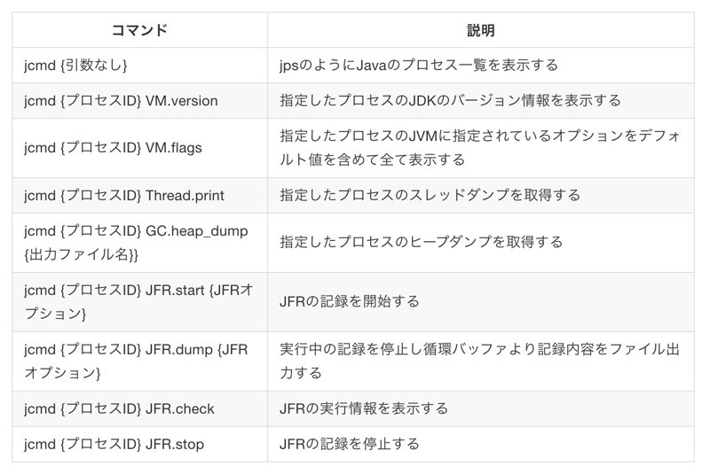
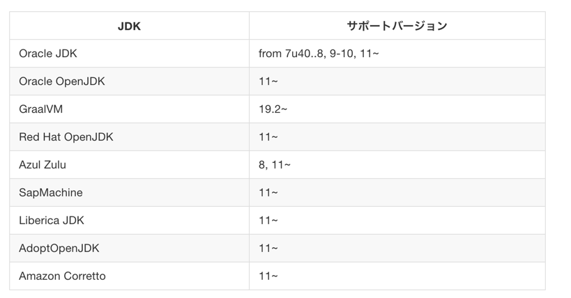
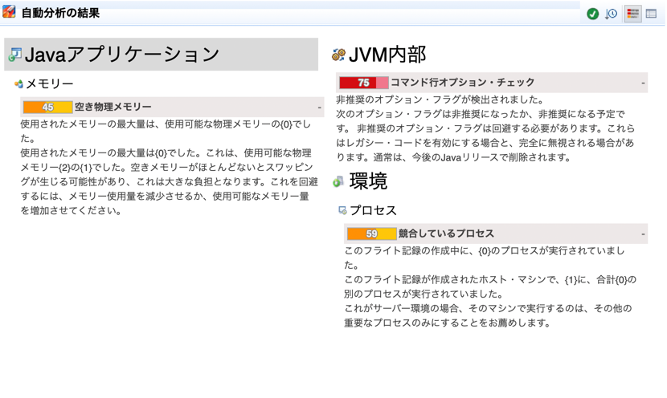

https://koduki.github.io/docs/book-introduction-of-jfr/site/01/02-other_tools.html

## JPLIS(javaagent)

Java Programming Language Instrumentation Servicesの略

クラスロード時にエージェントがクラス情報を書き換えるAPI
- 情報取得
- プロファイリング用アスペクトの処理(traceとか）を埋め込む

## ツール

- java visualVM
  - jmxの情報をGUIで見られる
  - previewでJFR対応あり
  - JMCがhotspotに同梱されるようになって影が薄いらしい
- jdk mission control
  - https://github.com/JDKMissionControl/jmc
  - JFRのvisualizeとしてはほぼ一択
- JFR tool
  - JDK12から導入された新しいツール
  - JFRをjsonやxmlにできる
- jcmd
  - JFRの操作, プロセスの取得, スレッドダンプの取得などができる

https://koduki.github.io/docs/book-introduction-of-jfr/site/01/02-other_tools.html

もう古い
- jconsole
  - visualVMでおｋ
- hprof
  - オーバーヘッドが大きいので本番向きではない（開発・テストならIDEのものでよい）
- jps
  - psコマンドで良い（が、javaだけにフィルターされるので便利といえば便利）
- jstat
  - GCを含むヒープを見れる
- jstack
  - thread dumpを取得する
  - 定期実行をするスクリプトを組むか、障害時に数回叩いてスレッドの情報を取得する
- jmap
  - heap dumpを取得する
  - ヒープサマリー、ヒストグラム、統計情報などがみられる
  - fullGC注意

### JFR環境

今はもう少し進んでいて例えばcorreto8で使えたりしそう
https://twitter.com/matsu_chara/status/1400418684477218821

### JMC

downloadは https://github.com/corretto/corretto-jmc/releases などdistributorがビルドした物を使うとよい

基本どのdistributorのものも同じものなので、correto以外のJMCをcorretoで使ったり、逆なども普通に動く（らしい）

JMCではJFRだけではなく、JMXでリアルタイムの値を取得する事も可能(Mbeanサーバーというのをダブルクリックする)
※ Mbeanはmanaged beanの略で管理されるbeanのことらしい（よくわからない）

JFRファイルの取得・表示も可能（本番ではJMCでのJFRファイルの取得はしないはず）

取得すると非推奨なフラグなども自動解析してくれる

### JFR取得

取得方法は以下

- GUI(JMC/VisualVM)
  - 本番ではやらない
- CLI
  - jcmd
    - `jcmd 1234 JFR.start duration=1m filename=myrecording.jfr`
    - `jcmd 1234 JFR.dump filename=myrecording.jfr`
- JVMオプション
  - jdk8
    - `-XX:+UnlockCommercialFeatures -XX:+FlightRecorder -XX:FlightRecorderOptions=defaultrecording=true, dumponexit=true, dumponexitpath=/var/log/myapp/myapp.jfr`
  - jdk11
    - `-XX:StartFlightRecording=dumponexit=true, filename=/var/log/myapp/myapp.jfr`

- プログラム

